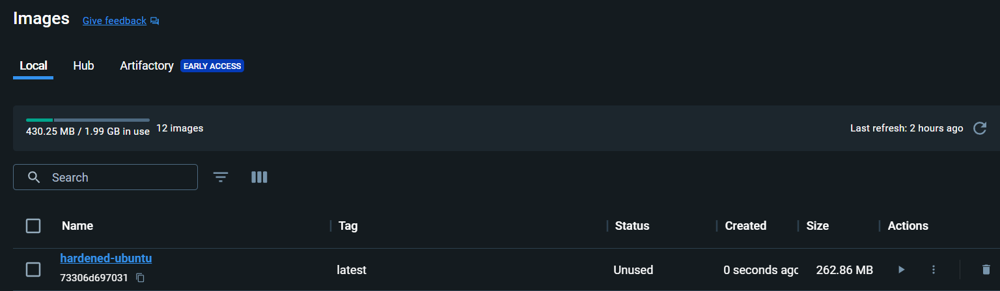
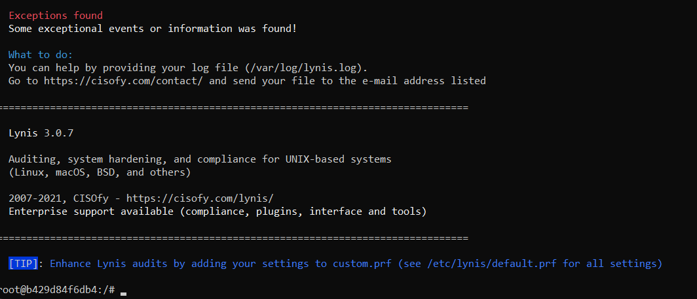

# 1. Praktische Übung: Systemhärtung eines Ubuntu Docker Containers

## ziel

Die Lernenden lernen, wie man einen minimalen Ubuntu-Container systematisch absichert und dabei typische Massnahmen der Systemhärtung anwendet.

---
## Voraussetzungen 

- Docker ist lokal installiert (z. B. via Docker Desktop oder Linux)
- Basis-Image: ubuntu:22.04
- Einfache Kenntnisse im Umgang mit dem Terminal

---

## Ausgangslage 

Sie erstellen einen Container mit dem Image ubuntu:22.04, installieren typische Tools und führen anschliessend konkrete Massnahmen zur Härtung durch.

---

## Ablauf 

1. Erstellen Sie einen Container mit dem Image ubuntu:22.04

```bash
docker run -it --name hardeninglab ubuntu:22.04 /bin/bash
```
Im Container: 

```bash
apt update
apt install -y openssh-server net-tools nano
apt upgrade
```
### IST-Zustand Analysieren

```bash
ss -tuln         # Offene Ports anzeigen
ps aux           # Laufende Prozesse anzeigen
cat /etc/passwd  # Benutzerkonten checken
ls /home         # Benutzerverzeichnisse prüfen
```
--- 

### Hardening durchführen

| Massnahme                                  | Beschreibung                                                |
| ------------------------------------------ | ----------------------------------------------------------- |
| 1. SSH-Root-Login deaktivieren             | `nano /etc/ssh/sshd_config` → `PermitRootLogin no`          |
| 2. Starkes Passwort setzen                 | `passwd root` → wählen Sie ein sicheres Passwort            |
| 3. Neuen Benutzer anlegen                  | `adduser student && usermod -aG sudo student`               |
| 4. Nur SSH starten, keine weiteren Dienste | Entfernen Sie unnötige Pakete z. B. mit `apt remove`        |
| 5. UFW installieren und aktivieren         | `apt install ufw && ufw allow ssh && ufw enable`            |
| 6. TCP- und UDP-Ports prüfen               | Erneut `ss -tuln` und vergleichen                           |
| 7. Deaktivieren von IPv6 (optional)        | in `/etc/sysctl.conf`: `net.ipv6.conf.all.disable_ipv6 = 1` |
| 8. Unnötige Software entfernen             | Z. B. `nano`, `net-tools` falls nicht gebraucht             |


### 1.1 SSH-Root-Login deaktivieren

- In /etc/ssh/sshd_config die Zeile PermitRootLogin no gesetzt und den SSH-Dienst neu gestartet:

```bash
nano /etc/ssh/sshd_config
service ssh restart
```
- Warum sicher: Root kann nicht mehr direkt per SSH anmelden. Heisst Brute-Force-Angriffe auf das mächtigste Konto wird erschwert oder das Risiko erheblich reduziert.

- test 
```bash
grep PermitRootLogin /etc/ssh/sshd_config
# Output
PermitRootLogin no
# the setting of "PermitRootLogin without-password".
``` 

### 1.2 Starkes Passwort setzen

```bash
passwd root
New password:
Retype new password:
TBZm182+
passwd: password updated successfully
```
- Warum sicher: Verhindert, dass einfache Passwortlisten Root-Zugang ermöglichen. Passwort ist Lang, Sonderzeichen, Groß-/Kleinschreibung 

- prüfung: Login mit neuem Passwort

### 1.3 Neuen Benutzer anlegen

```bash
adduser student
Adding user `student' ...
Adding new group `student' (1000) ...
Adding new user `student' (1000) with group `student' ...
Creating home directory `/home/student' ...
Copying files from `/etc/skel' ...
New password: #+TBZm182+
Retype new password:
passwd: password updated successfully
Changing the user information for student
Enter the new value, or press ENTER for the default
        Full Name []:
        Room Number []:
        Work Phone []:
        Home Phone []:
        Other []:
Is the information correct? [Y/n] Y

usermod -aG sudo student
``` 
- Warum sicher: Benutzer können sich mit normalen Account ohne adminrechte anmelden. 

- prüfung: 
```bash
id student
uid=1000(student) gid=1000(student) groups=1000(student),27(sudo)
```

### 1.4 Nur SSH starten, keine weiteren Dienste

```bash
ps aux
USER       PID %CPU %MEM    VSZ   RSS TTY      STAT START   TIME COMMAND
root         1  0.0  0.0   4628  3456 pts/0    Ss   06:06   0:00 /bin/bash
root        33  0.0  0.0  15436  4308 ?        Ss   06:59   0:00 sshd: /usr/sbin/sshd [listener] 0 of 10-100 startups
root        39  0.0  0.0   7064  2816 pts/0    R+   06:59   0:00 ps aux

ss -tuln
Netid      State       Recv-Q      Send-Q            Local Address:Port             Peer Address:Port      Process
tcp        LISTEN      0           128                     0.0.0.0:22                    0.0.0.0:*
tcp        LISTEN      0           128                        [::]:22                       [::]:*

```
- Warum sicher: Weniger software = weniger Angriffsfläche
- Nur sshd sollte laufen und Port 22 sollte offen 

### 1.5 UFW installieren und aktivieren

```bash
apt install -y ufw
ufw allow ssh
ufw enable

root@f8e7b987ba43:~# ufw allow ssh
WARN: initcaps
[Errno 2] iptables v1.8.7 (nf_tables): Could not fetch rule set generation id: Permission denied (you must be root)


Rules updated
Rules updated (v6)
root@f8e7b987ba43:~# ufw status
ERROR: problem running iptables: iptables v1.8.7 (nf_tables): Could not fetch rule set generation id: Permission denied (you must be root)
```

- Warum sicher: Sicherstellung, dass alle Ports geblockt sind, die nicht benötigt werden

- prüfung: 
```bash
ufw status
```
### 1.6 TCP- und UDP-Ports prüfen
```bash
ss -tuln
```
- Warum sicher: Sicherstellung, dass nur die benötigten Ports offen sind
- prüfung: Nur port 22 offen

### 1.7 Deaktivieren von IPv6 (optional)
```bash
nano /etc/sysctl.conf
net.ipv6.conf.all.disable_ipv6 = 1
net.ipv6.conf.default.disable_ipv6 = 1
``` 
- aktivieren mit `sysctl -p`
- sysctl -p: ändert Kernel Parameter
- Die Werte (disable_ipv6 = 1) werden zwar angezeigt, aber sie wurden nicht übernommen, sondern nur aus der Datei gelesen.

- warum sicher: IPv6 bringt zusätzliche Sicherheitsprobleme

- prüfung: 
```bash
ip a
```
### 1.8 Unnötige Software entfernen 
```bash
apt remove -y nano net-tools
apt autoremove -y
``` 
-warum sicher: Weniger Software = weniger Angriffsfläche

- Prüfung:
```bash 
dpkg -l | grep nano
dpkg -l | grep net-tools
```
Container ist auf SSH-Betrieb reduziert, mit Firewall abgesichert, Root-Login blockiert und Benutzerverwaltung aktiv.

### 1.9 Container speichern 

```bash
exit
docker commit hardeninglab hardened-ubuntu
sha256:73306d6970319e9f148b92b5b01536416c6ae2a1c41b5a7985600e9bdea7c8ea
```


### 1.10 (Optional) Bonus: CIS-Check
```bash
apt install -y lynis
lynis audit system
```
- Nach der ausführung kann man via link die Fehler prüfen


## 1.11 Reflexionsfragen

- Welche Dienste waren unnötig offen?
 Nach Härtung war nur Port 22 offen. Bewiesen durch ss -tuln.
- Welche Konfiguration war besonders sicherheitsrelevant?
 Aktivierung der Root-Login-Blockierung mit PermitRootLogin no
Erstellung eines nicht-root Benutzers mit sudo-Rechten
Aktivierung der Firewall (UFW) mit nur SSH-Freigabe
Deaktivierung von IPv6, um zusätzliche Angriffsflächen zu vermeiden (hat jedoch nicht funktioniert)
Entfernung unnötiger Software, um die Angriffsfläche zu minimieren
- Wie unterscheidet sich ein gehärteter Container von einem „Vanilla“-Image?.
| Nr. | Aspekt            | Vanilla-Image                               | Gehärteter Container                                                                    |
| --- | ----------------- | ------------------------------------------- | --------------------------------------------------------------------------------------- |
| 1   | Dienste/Ports     | Standarddienste aktiv; teils unnötige Ports | Nur benötigte Dienste; unnötige Ports geschlossen (Default-Deny/enge Firewall-Regeln)   |
| 2   | Benutzer & Rechte | Läuft oft als `root`; viele Capabilities    | Nicht-root-User; `--cap-drop=ALL`, nur nötige Caps, `--security-opt no-new-privileges`  |
| 3   | Software/FS       | Viele Pakete; schreibbares Root-FS          | Minimal-Pakete; `--read-only`, `--tmpfs`; regelmäßige Updates/Patches                   |
