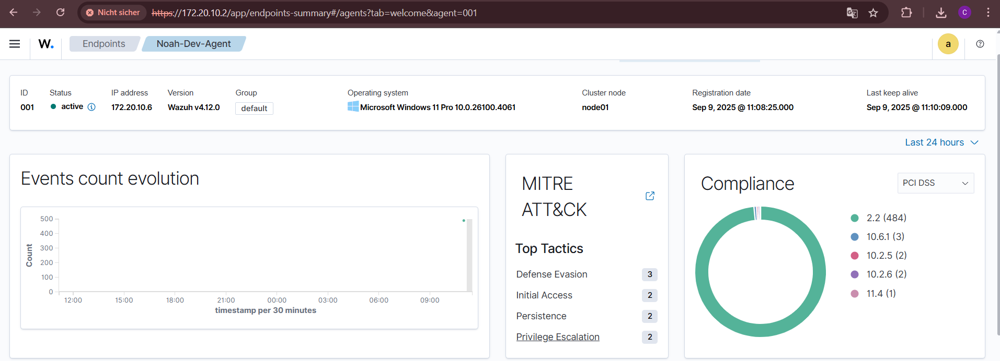
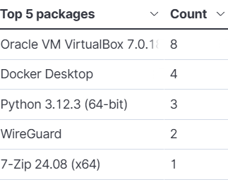
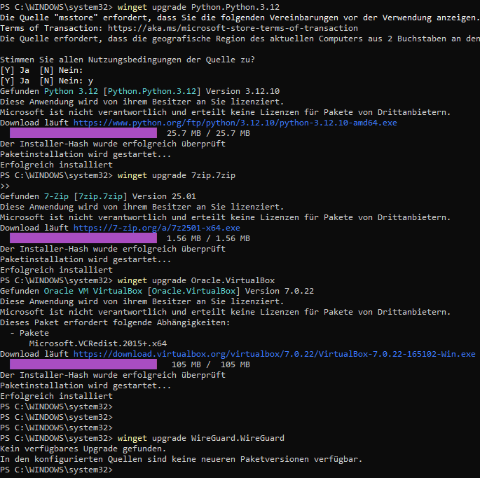

# monitoring_mit_wazuh

## 1.0 Installation

Hier ist eine kurze Anleitung zur Installation von Wazuh. 

### 1.1 Ablauf

Lade die Wazuh Datei herunter und füge sie danach in Virtualbox ein.

https://packages.wazuh.com/4.x/vm/wazuh-4.12.0.ova

- Folge Der anleitung Online

##### Hinweis:
Verbinde dich mit einem Hotspot nicht Schulnetzwerk. Dies verhindert dass du keine IP bekommst.


### 1.2 Agent installieren

- Gehe auf folgende Seite und folge der Anleitung:
 https://documentation.wazuh.com/current/installation-guide/wazuh-agent/index.html

 - Führe die Befehle in Powershell als Administrator aus

 Jetzt sollte es so auf deinem Wazuh Agent aussehen:
 

 ### 1.3 Massnahmen zur Hertung

 - In Wazuh
 

 Ich sehe, dass ich ein paar Packages noch nicht geupdated habe. Desshalb ist mein Hardening Schritt, dies nun zu tun. 

 --- 
 Meine Updates führe ich via Powershell aus:
Ausnahme: Docker, kann ich in der GUI aktualisieren.

Mit winget kann ich die Updates von Windows herunterladen und installieren.

```bash

```
Danach sieht es so aus:


Bei WireGuard hat es erstaunlicherweise keine Updates gegeben. 